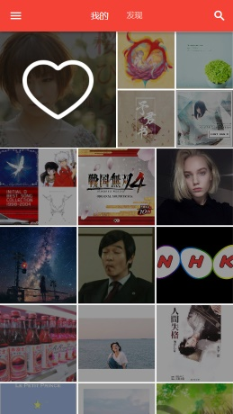
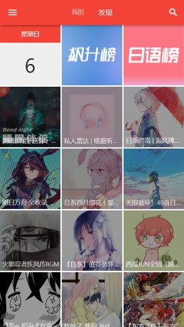
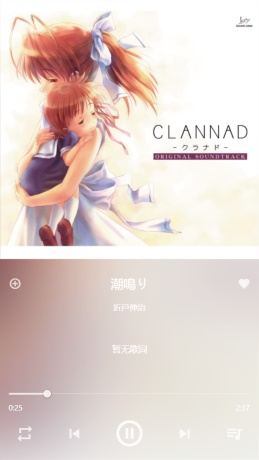
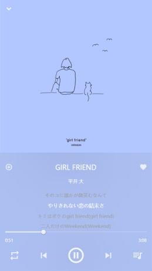
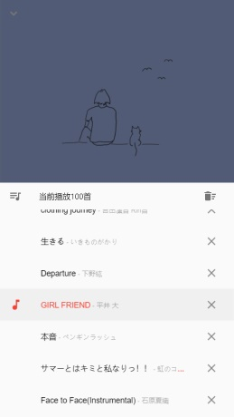

# 网易云音乐 Flutter

https://summerscar.me/NeteaseCloudMusic-Flutter/

## Download

apk: [download](https://github.com/summerscar/NeteaseCloudMusic-Flutter/releases)

web: [download](https://github.com/summerscar/NeteaseCloudMusic-Flutter/releases)

## Backend
* [NeteaseCloudMusicApi](https://binaryify.github.io/NeteaseCloudMusicApi)
* [leancloud](https://leancloud.app/)

## Done
* 用户歌单
* 每日推荐
* 排行榜
* 搜索音乐
* 收藏至歌单
* ❤ 音乐

## Todo
* ~~搜索历史~~
* 私人电台
* ~~歌单音乐删除~~
* 歌手信息页
* ......

## Support platform
* Web
* Android
* IOS - Not tested
* Widnows - Not tested
* Linux - Not tested
* MacOS - Not tested

## Preview

## Reference
* [gallery](https://github.com/flutter/gallery)
* [flutter_catalog](https://github.com/X-Wei/flutter_catalog)
* [flutterchina](https://flutterchina.club/)
* [flutter.cn](https://flutter.cn/)
* [flutlab.io](https://flutlab.io/)
